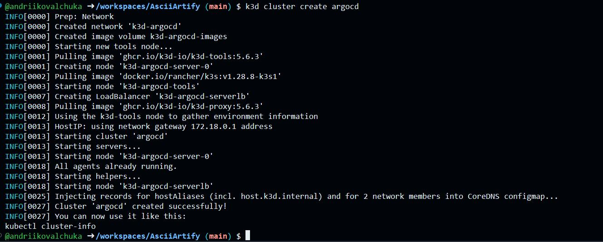
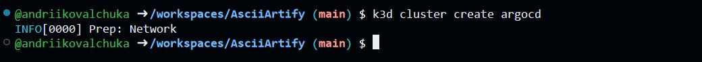
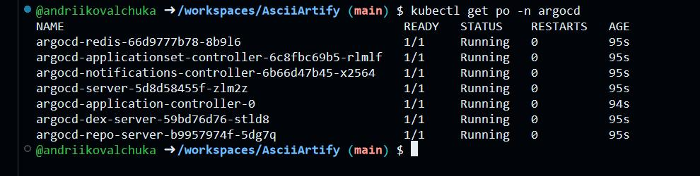
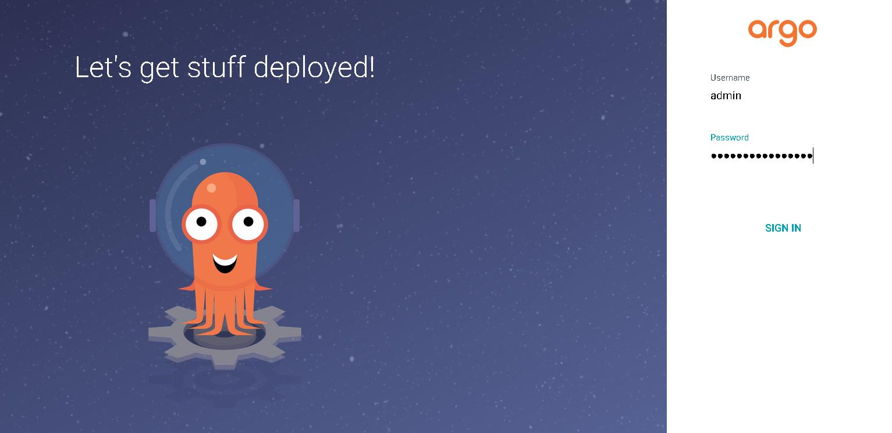
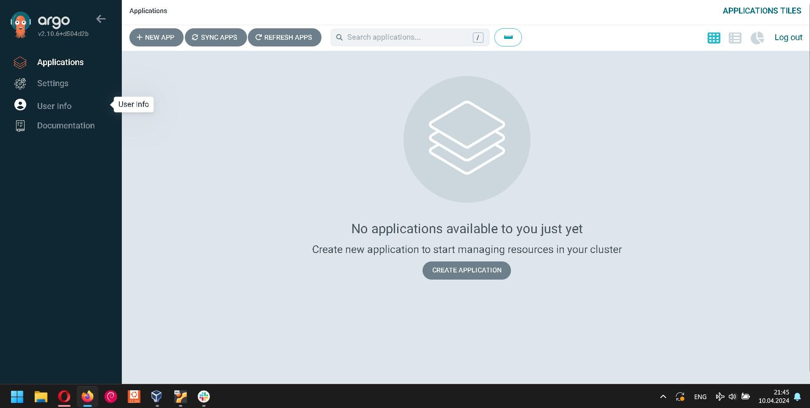

# Installation of ArgoCD with a graphical interface in the k3d cluster 

## Brief description of ArgoCD
ArgoCD is a popular open source continuous delivery tool for Kubernetes that automates application deployment and health monitoring. It provides both a graphical web user interface and a CLI for managing and deploying applications across multiple clusters and environments. Implements a GitOps approach using the Git repository as a source to determine the desired state of the application

## Installation ArgoCD

Create a cluster with the name argocd using k3d
```bash
k3d cluster create argocd
```


At the begining of the installation of ArgoCD, we will create the namespace argocd, in which, by default, it will be installed.

```bash
kubectl create namespace argocd
```


Run the manifest containing all the necessary services and configurations to install ArgoCD:

```bash
kubectl apply -n argocd -f https://raw.githubusercontent.com/argoproj/argo-cd/stable/manifests/install.yaml
```

Verify the creation of the ArgoCD namespace and resources

```bash
kubectl get ns
kubectl get all -A -n argocd
kubectl get pods -n argocd
```


## Access to ArgoCD GUI

To access the ArgoCD GUI, we use port-forward

```bash
kubectl port-forward svc/argocd-server -n argocd 8080:443&
```
The ArgoCD GUI will be available on the local machine at: https://localhost:8080 

To get the password, you need to use the following command:
```bash
kubectl -n argocd get secret argocd-initial-admin-secret -o jsonpath="{.data.password}" | base64 -d; echo

```

Using the specified password and `admin' login, we will enter the system.





- After logging in, you will be taken to the ArgoCD dashboard, which contains an overview of all applications managed by ArgoCD.


- The application list will display all applications managed by ArgoCD along with their current status. To view the details of a specific application, click on its name in the list.

- In the app, you can view details of its current deployment, including the Git repository it was sourced from, the target environment, and any current sync or health checks.

- From the app details page, you can perform various actions, including deploying the app to a new environment, syncing its configuration with a Git repository, and pushing a version to production..